# Orchestrator — Platformă de Orchestrare a Agenților AI
### Proiect de An · Facultatea de Informatică

---

## 1. Introducere și Scopul Lucrării

Lucrarea de față prezintă proiectarea și implementarea unei platforme software denumite **Orchestrator**, un sistem agentic bazat pe modele lingvistice mari (*Large Language Models* — LLM-uri), capabil să construiască, să execute și să monitorizeze fluxuri complexe de agenți AI. Obiectivul fundamental al lucrării constă în demonstrarea faptului că o aplicație software poate depăși limitele structural inerente ale unui singur apel către un model lingvistic, prin compunerea ordonată a mai multor agenți specializați.

Problema abordată este una de actualitate în domeniul inteligenței artificiale aplicate: un singur apel către un LLM prezintă constrângeri fundamentale — fereastra de context este finită, nu există memorie persistentă între apeluri și nu se pot formula decizii condiționale bazate pe conținutul răspunsului. Prin urmare, sarcinile complexe care necesită raționament multi-etapă, acces la resurse externe sau coordonare între mai mulți specialiști virtuali nu pot fi soluționate eficient printr-un prompt singular.

Platforma **Orchestrator** răspunde acestei provocări prin mai multe mecanisme tehnice complementare: compunerea vizuală a agenților în grafuri direcționate aciclice (DAG), memoria partajată între agenți pe durata execuției, execuția paralelă a ramurilor independente din graf, reziliența automată prin mecanisme de reluare (*retry*) și comutare la modele alternative (*fallback*), observabilitatea în timp real prin streaming SSE (*Server-Sent Events*) și posibilitatea intervenției umane (*Human-in-the-Loop*) în puncte critice ale fluxului de execuție.

---

## 2. Problema Rezolvată

Odată cu maturizarea modelelor lingvistice mari de tip GPT-4o, Gemini și Claude, tot mai multe organizații încearcă să construiască aplicații AI care să depășească paradigma conversațională simplă. Aceste aplicații necesită pipeline-uri de procesare a textului cu mai mulți pași specializați — de exemplu, cercetare, sinteză, redactare și verificare —, decizii condiționale bazate pe output-ul unui agent, execuție paralelă pentru eficiență și persistența stării între pași, astfel încât un agent să poată accesa rezultatele produse de agenții anteriori.

Soluția propusă constă într-o interfață vizuală de tip *drag-and-drop* în care utilizatorul poate construi aceste fluxuri fără a scrie cod, conectând noduri care reprezintă agenți AI, puncte de decizie condițională și noduri de aprobare umană. Fluxul rezultat este persistent în baza de date, reutilizabil și exportabil, permițând reproducibilitatea și partajarea automatizărilor.

---

## 3. Arhitectura Proiectului

Proiectul este structurat ca un **monorepo** gestionat prin workspaces npm, împărțit în trei pachete cu responsabilități distincte: serverul de backend, aplicația frontend și pachetul de scheme partajate. Această organizare permite copartajarea tipurilor și a logicii de validare fără duplicare de cod, menținând în același timp independența fiecărui modul la nivelul dependențelor și al procesului de build.

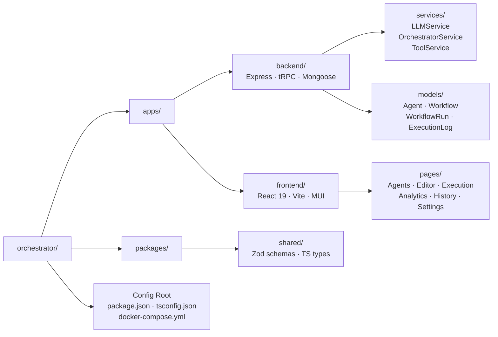

### 3.1 Backend (`apps/backend`)

Stratul de backend este construit pe **Node.js** cu framework-ul **Express** și expune două categorii distincte de endpoint-uri, fiecare optimizată pentru tipul de interacțiune pe care îl servește.

Prima categorie este reprezentată de procedurile **tRPC** (*type-safe Remote Procedure Call*), utilizate pentru operațiunile CRUD clasice: gestiunea agenților, a workflow-urilor, a template-urilor de prompt și a setărilor de aplicație. Prin utilizarea tRPC, tipurile de date sunt derivate automat din schemele Zod definite în `packages/shared`, garantând type-safety end-to-end între frontend și backend fără generare suplimentară de cod. Orice modificare de tip pe server devine imediat o eroare de compilare TypeScript pe client, prevenind în mod structural inconsistențele de integrare.

A doua categorie este reprezentată de endpoint-urile **SSE** (*Server-Sent Events*), utilizate pentru execuția workflow-urilor în timp real. Endpoint-ul `/api/execute-stream` inițializează un generator asincron care transmite evenimentele de execuție — pornire pas, fragment de text (*chunk*), actualizare memorie, eroare, finalizare — direct în browser, fără a necesita polling periodic. Un al doilea endpoint, `/api/execute-resume`, permite reluarea unui workflow care a fost întrerupt la un nod de tip `wait`. Totodat, serverul aplică un mecanism de limitare a ratei de cereri de 100 de cereri per 15 minute pe rutele expuse public, reducând riscul de abuz al API-ului.

### 3.2 Frontend (`apps/frontend`)

Aplicația client este implementată în **React 19**, construită cu **Vite** și cu rutare client-side prin **React Router v7**. Interfața utilizează tema de tip *dark mode* și este construită cu componentele **Material UI v9**, completate de iconografii **Lucide React**. Comunicarea cu serverul se realizează exclusiv prin clientul **tRPC React Query**, toate query-urile și mutațiile beneficiind de caching automat și invalidare prin **TanStack Query v5**.

### 3.3 Shared (`packages/shared`)

Pachetul partajat conține schemele **Zod** pentru toate entitățile aplicației. Aceste scheme sunt importate atât de backend — pentru validarea input-ului în procedurile tRPC —, cât și de frontend — pentru validarea formularelor. Tipurile TypeScript sunt derivate din scheme prin constructul `z.infer<>`, asigurând o singură sursă de adevăr pentru definițiile de date ale întregii aplicații. Astfel, orice modificare de schemă se propagă automat în toate punctele de utilizare, fără riscul apariției de discrepanțe între straturi.


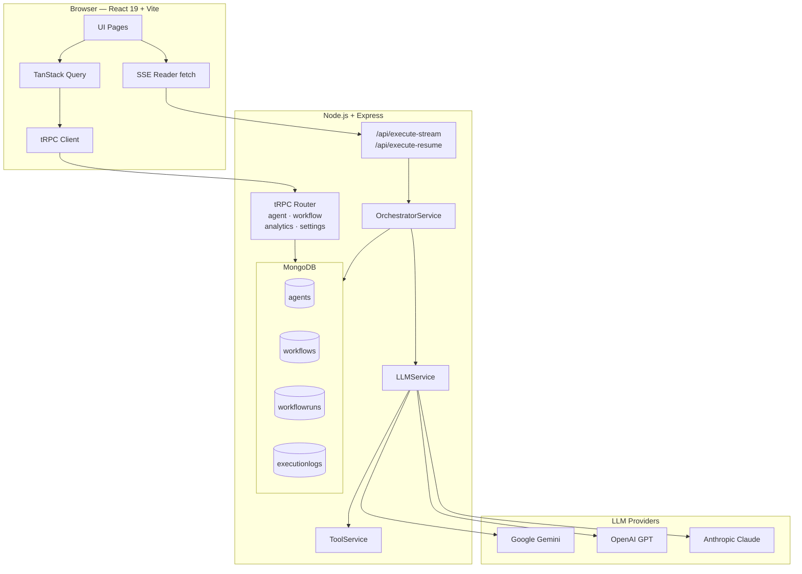

---

## 4. Tehnologii Utilizate și Justificare

| Tehnologie | Versiune | Rol | Motiv ales |
|---|---|---|---|
| Tehnologie | Versiune | Rol | Justificare |
|---|---|---|---|
| **Node.js** | v20+ | Runtime backend | Model de execuție asincron nativ, optim pentru aplicații I/O-intensive |
| **Express** | 4.x | HTTP server | Flexibilitate maximă pentru integrarea simultană a tRPC și SSE |
| **tRPC** | v11 | Strat API | Elimină boilerplate-ul REST; type-safety E2E fără generare de cod OpenAPI |
| **Mongoose** | v9 | ODM MongoDB | Schemă flexibilă, adecvată documentelor cu structură variabilă la runtime |
| **MongoDB** | latest | Bază de date | Stocarea stării de execuție (*câmpuri Mixed*) este naturală în format JSON |
| **Zod** | v4 | Validare schemă | Validare runtime și inferență TypeScript din aceeași definiție |
| **React** | v19 | UI Framework | Framework frontend cu cel mai larg ecosistem și maturitate |
| **Vite** | v6 | Build tool | HMR instant și timp de build redus în dezvoltare |
| **Material UI** | v9 | Component library | Design system matur cu suport nativ pentru dark mode |
| **ReactFlow** | — | Editor vizual DAG | Singura bibliotecă React matură pentru editoare interactive de grafuri |
| **TanStack Query** | v5 | State management | Caching automat, refetch și gestionare state asincron |
| **TypeScript** | 5.8 | Limbaj | Type safety la compilare pentru ambele aplicații |
| **Docker / Compose** | — | Containerizare | Portabilitate și deployment reproductibil în orice mediu |
| **@google/genai** | v1 | SDK Gemini | Acces la Gemini Flash și Pro cu tool calling nativ |
| **openai** | — | SDK OpenAI | Acces la GPT-4o și GPT-3.5 cu suport streaming |
| **@anthropic-ai/sdk** | — | SDK Anthropic | Acces la Claude Sonnet și Opus cu suport streaming |
| **AES-256-CBC** | — | Criptare | Cheile API stocate în baza de date sunt criptate simetric |

Alegerile arhitecturale cele mai semnificative sunt detaliate în continuare.

**Motivul alegerii MongoDB în locul unui SGBD relațional.** Starea unui `WorkflowRun` este stocată ca `Schema.Types.Mixed` — un câmp JSON arbitrar care crește dinamic pe măsură ce agenții scriu valori noi prin instrumentul `store_memory`. Această structură este dificil de modelat eficient într-un tabel SQL fără a recurge la coloane de tip JSON sau tabele auxiliare. MongoDB permite stocarea naturală a acestor documente cu structură variabilă, iar Mongoose oferă validare și join-uri populate (`.populate()`) suficiente pentru nevoile aplicației.

**Motivul alegerii tRPC în locul unui API REST clasic.** Alternativa tradițională presupune documentarea unui API REST cu OpenAPI/Swagger și generarea unui client. tRPC elimină complet acest pas: procedurile sunt definite o singură dată pe server, iar clientul React primește automat tipurile corecte pentru fiecare query și mutație. Prin urmare, orice modificare de tip pe backend devine imediat o eroare TypeScript pe frontend, prevenind în mod structural bug-urile de integrare.

**Motivul alegerii SSE în locul WebSockets.** Streaming-ul execuției este unidirecțional — de la server către client. SSE este mai simplu de implementat și de integrat cu Express decât WebSockets, nu necesită un protocol de handshake bidirecțional și este nativ suportat de browserele moderne prin `EventSource` sau `fetch` cu `ReadableStream`.

---

## 5. Baza de Date — Modele și Relații

Aplicația utilizează **MongoDB** ca sistem de gestiune a bazei de date, accesat prin biblioteca ORM **Mongoose**. Sunt definite șase colecții, fiecare cu un rol distinct în arhitectura de date a sistemului, după cum ilustrează diagrama entitate-relație de mai jos.


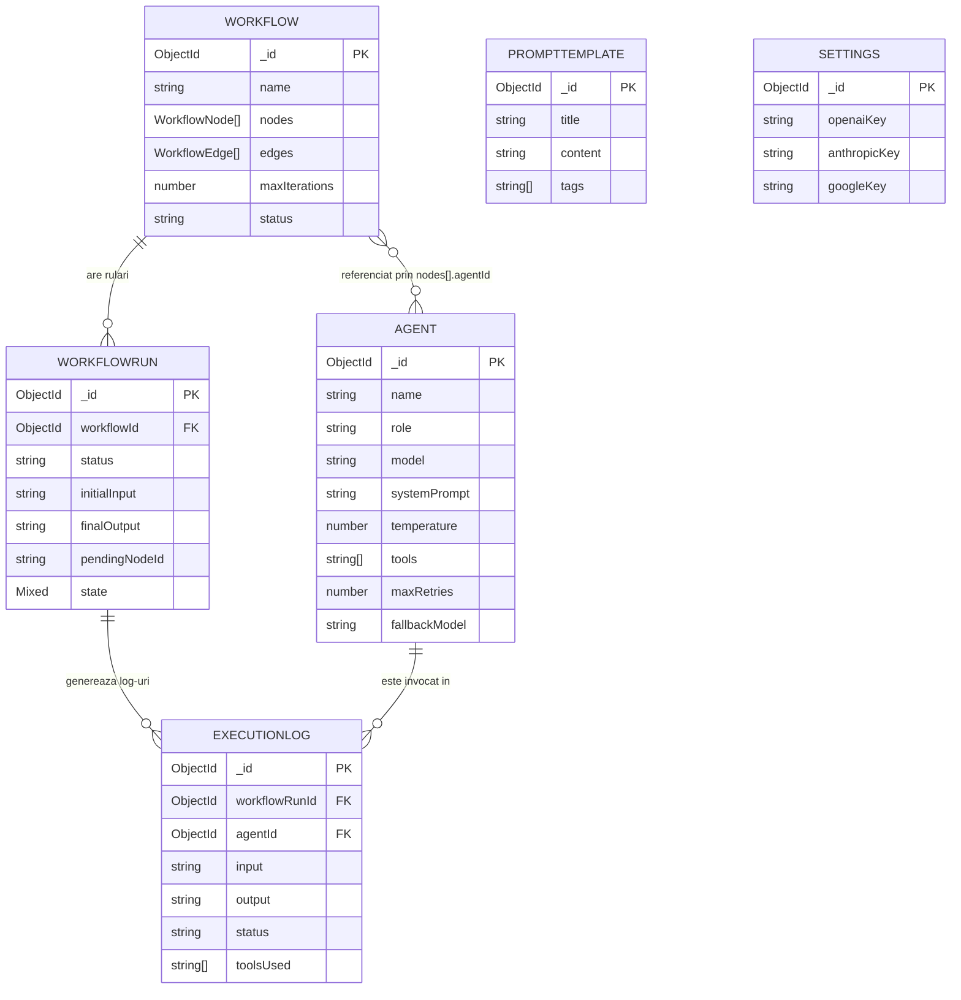

### 5.1 `agents`

Colecția `agents` stochează definiția unui agent AI reutilizabil, independent de orice workflow concret. Separarea agentului de workflow permite utilizarea aceluiași agent specializat în mai multe fluxuri diferite — de exemplu, un agent de tip *redactor tehnic* poate fi integrat atât într-un pipeline de generare de documentație, cât și într-unul de analiză de cod.

```
Agent {
  name:          String   (req, min 2 chars)
  role:          String   (req) — descrierea rolului agentului în sistem
  model:         Enum     — unul din cele 6 modele suportate
  systemPrompt:  String   (req) — instrucțiunile de sistem injectate la fiecare execuție
  temperature:   Number   (0-1, default 0.7) — creativitate vs. determinism
  tools:         [String] — lista de instrumente pe care agentul le poate invoca
  maxRetries:    Number   (0-5, default 2) — numărul de reluări automate la eșec
  fallbackModel: String?  — modelul alternativ utilizat dacă modelul primar eșuează
  createdAt/updatedAt: Date (auto)
}
```

### 5.2 `workflows`

Colecția `workflows` reprezintă definiția statică a unui flux de agenți — structura grafului, nu starea sa de execuție. Graful este stocat ca două liste: noduri și muchii (reprezentare de tip *liste de adiacență*), care constituie reprezentarea standard pentru grafuri direcționate aciclice. Câmpul `label` de pe muchie permite routing condiționat: dacă output-ul unui agent conține valoarea etichetei, muchia respectivă este activată, permițând astfel ramificarea fluxului pe baza conținutului generat.

```
Workflow {
  name:          String   (req)
  description:   String?
  nodes:         [WorkflowNode] — nodurile grafului DAG
  edges:         [WorkflowEdge] — legăturile direcționate între noduri
  steps:         [WorkflowStep] — lista ordonată (modul secvențial legacy)
  maxIterations: Number   (default 10) — limita circuit breaker pentru cicluri
  status:        Enum     ["draft", "active", "archived"]
  createdAt/updatedAt: Date (auto)
}

WorkflowNode {
  id:           String   (unic în graf)
  type:         Enum     ["input", "agent", "output", "wait", "router"]
  agentId:      ObjectId? → ref Agent
  tools:        [String]
  waitForAll:   Boolean  — dacă nodul așteaptă TOȚI predecesorii (join)
  mergeContext: Boolean  — dacă combină output-urile mai multor predecesori
  position:     {x, y}  — coordonate vizuale pe canvas
  data:         {label}
}

WorkflowEdge {
  id:     String
  source: String → node.id
  target: String → node.id
  label:  String? — condiție opțională (ex: "DA", "EROARE")
}
```

### 5.3 `workflowruns`

Colecția `workflowruns` reprezintă starea runtime a unei execuții concrete — instanța unui workflow. Câmpul `state` de tip `Mixed` constituie fundamentul întregului sistem de memorie partajată: agenții pot scrie și citi valori arbitrare din acest obiect prin instrumentele `store_memory` și `retrieve_memory`, fără a necesita redefinirea schemei. Câmpul `nodeIterations` implementează mecanismul de *circuit breaker* pentru grafuri ciclice — dacă un nod este vizitat mai mult decât valoarea `maxIterations`, execuția este întreruptă automat pentru a preveni buclele infinite.

```
WorkflowRun {
  workflowId:     ObjectId → ref Workflow
  status:         Enum     ["running", "completed", "failed", "waiting"]
  startTime:      Date
  endTime:        Date?
  initialInput:   String
  finalOutput:    String?
  error:          String?
  pendingNodeId:  String?  — nodul la care execuția este pausată (HITL)
  nodeIterations: Map<String, Number> — numărul de vizitări per nod (anti-loop)
  state:          Mixed    — memoria partajată key-value a execuției
}
```

### 5.4 `executionlogs`

Colecția `executionlogs` înregistrează istoricul detaliat al fiecărui pas individual de execuție. Separarea log-urilor de colecția `workflowruns` permite efectuarea de interogări analitice eficiente direct la nivelul bazei de date — de exemplu, identificarea instrumentelor cel mai frecvent utilizate, sau a agenților cu cele mai multe erori. Câmpul `toolsUsed` asigură trasabilitatea completă a invocărilor de instrumente per pas.

```
ExecutionLog {
  workflowId:    ObjectId → ref Workflow
  workflowRunId: ObjectId → ref WorkflowRun
  agentId:       ObjectId → ref Agent
  nodeId:        String?
  iteration:     Number?
  input:         String   — input-ul primit de agent
  output:        String   — output-ul generat de agent
  status:        Enum     ["success", "error"]
  toolsUsed:     [String] — instrumentele apelate de agent în acest pas
  timestamp:     Date
}
```

### 5.5 `prompttemplates`

Colecția `prompttemplates` stochează o bibliotecă de șabloane de prompt predefinite, organizate cu etichete (*tags*) pentru căutare și filtrare. Acestea pot fi selectate direct în interfața de execuție pentru a preinițializa câmpul de input al unui workflow.

```
PromptTemplate {
  title:   String (req)
  content: String (req)
  tags:    [String]
  createdAt/updatedAt: Date (auto)
}
```

### 5.6 `settings`

Colecția `settings` funcționează ca un document singleton la nivel de aplicație, stocând cheile API ale furnizorilor de modele lingvistice în formă criptată. Cheile sunt criptate cu algoritmul **AES-256-CBC** utilizând un vector de inițializare (*IV*) aleator generat per cheie înainte de stocare. La citire, acestea sunt decriptate în memorie și utilizate pentru inițializarea SDK-urilor corespunzătoare. Ca alternativă, utilizatorul poate furniza chei direct per sesiune de execuție, fără a trece prin baza de date.

```
Settings {
  openaiKey:    String  — cheie OpenAI criptată AES-256-CBC
  anthropicKey: String  — cheie Anthropic criptată AES-256-CBC
  googleKey:    String  — cheie Google criptată AES-256-CBC
}
```

---

## 6. Serviciile Core

### 6.1 `LLMService`

Acest serviciu reprezintă stratul de abstractizare pentru interacțiunea cu modelele lingvistice. Arhitectura sa permite detecția automată a furnizorului de servicii AI (`google`, `openai` sau `anthropic`) bazată pe prefixul identificatorului de model, facilitând astfel un grad ridicat de decuplare între logica aplicației și implementările specifice ale SDK-urilor.

Serviciul expune două metode principale de generare:
- `generateContent()` — realizează o execuție sincronă, implementând suport nativ pentru apelarea de instrumente (*tool calling*), compatibil inclusiv cu interfața de funcții a modelului Gemini.
- `generateContentStream()` — realizează execuția cu suport pentru streaming, returnând un obiect de tip `AsyncGenerator<string>` care emite fragmente de text pe măsură ce acestea sunt generate de către model, reducând latența percepută de utilizator.

Rezoluția cheilor de autentificare API urmează o ierarhie strictă de priorități:
1. Cheia furnizată de utilizator pentru sesiunea curentă de execuție (stocată volatil în `localStorage` pe client).
2. Cheia stocată în formă criptată în baza de date centrală (colecția Settings).
3. Cheia definită global la nivelul variabilelor de mediu ale serverului (`.env`).

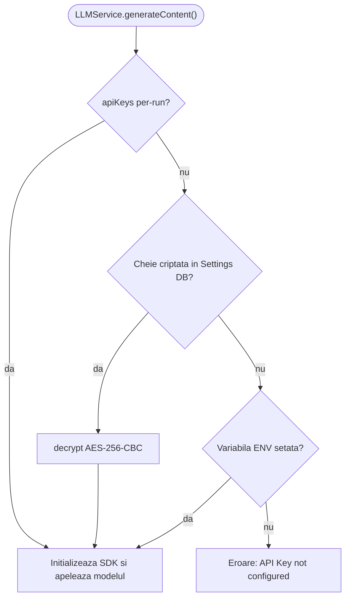

### 6.2 `ToolService`

Acest modul gestionează și execută setul de instrumente externe disponibile agenților. Arhitectura extensibilă permite adăugarea facilă de noi capabilități. În stadiul curent, sistemul suportă următoarele instrumente:

| Instrument | Descriere Funcțională |
|---|---|
| `calculator` | Evaluează expresii matematice complexe, eliminând predispoziția modelelor lingvistice la halucinații aritmetice. |
| `get_current_time` | Returnează data și ora curentă în format standardizat ISO, ancorând agentul în contextul temporal actual. |
| `web_search` | Simulează o interogare web pentru extragerea de informații de actualitate. |
| `store_memory` | Salvează o structură de date în starea partajată a instanței de execuție. |
| `retrieve_memory` | Extrage o structură de date stocată anterior în memoria globală. |

Instrumentele `store_memory` și `retrieve_memory` constituie nucleul mecanismului de **memorie globală partajată** al sistemului. Ele permit ca un rezultat intermediar produs de un agent să poată fi stocat și ulterior asimilat de un alt agent situat într-un nod inferior al grafului, rezolvând problema transferului de context între apeluri izolate.

### 6.3 `OrchestratorService`

Acesta reprezintă motorul central de execuție al platformei, responsabil pentru orchestrarea secvențială sau paralelă a apelurilor către modele. Serviciul implementează trei rutine asincrone principale bazate pe tiparul generatorului:

**`runWorkflowStream()`** — Execută fluxul într-un mod strict secvențial. Algoritmul ordonează pașii conform câmpului `order` definit în schemă și invocă succesiv fiecare agent, transmițând rezultatul nodului curent ca parametru de intrare pentru nodul următor. Modul suportă emiterea continuă de evenimente către client.

**`runWorkflowDAGStream()`** — Reprezintă algoritmul avansat de execuție pentru structuri de tip graf direcționat aciclic. Logica de parcurgere utilizează o abordare stratificată (de tipul căutării în lățime — BFS), caracterizată prin următoarele etape funcționale:
1. Inițializează execuția pornind de la nodul sursă (de tip `input`).
2. La fiecare nivel de adâncime, identifică setul de noduri active și le execută strict **în paralel** (utilizând primitive de tip `Promise.all`), maximizând astfeleficiența temporală.
3. Calculează dinamic componența nivelului următor pe baza evaluării condițiilor de tranziție definite pe muchiile grafului.
4. Gestionează pauzarea stării de execuție la întâlnirea nodurilor de tip `wait`.
5. Implementează puncte de sincronizare (*join nodes* — `waitForAll: true`), garantând că un nod dependent va fi activat exclusiv după finalizarea cu succes a tuturor nodurilor sale precursoare.
6. Injectează contextul curent din memoria partajată direct în mesajul de sistem al fiecărui agent convocat.
7. Asigură toleranța la erori prin implementarea unui mecanism de reîncercare cu *exponential backoff* și degradare grațioasă către un model lingvistic de rezervă.

**`resumeWorkflowDAGStream()`** — Reia o sesiune de execuție aflată în stare de așteptare la un nod `wait`. Metoda reconstruiește arborele de execuție analizând jurnalul istoric persisistent în baza de date și continuă iterarea grafului pornind de la nodul imediat următor.

Pentru prevenirea blocajelor, validarea structurală a grafului (în speță detectarea prezenței ciclurilor) este realizată apriori utilizând algoritmul lui Kahn pentru sortare topologică.

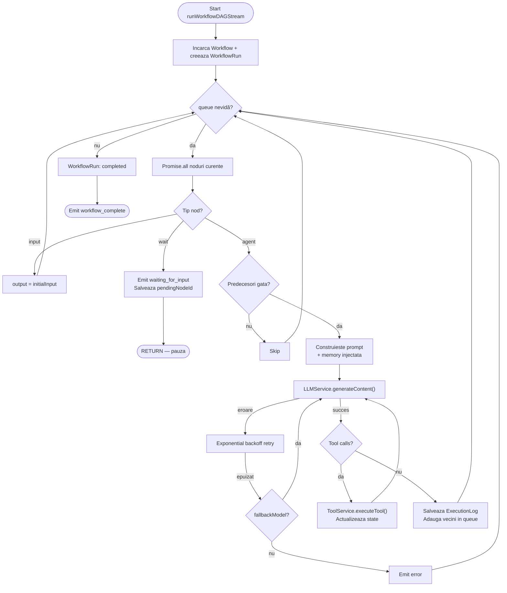

---

## 7. Funcționalitățile Aplicației

### 7.1 Gestionarea Agenților
Sistemul oferă interfețe dedicate pentru definirea, editarea și ștergerea entităților de tip agent. Parametrizarea unui agent presupune configurarea următoarelor proprietăți:
- **Rolul** și **prompt-ul de sistem**, elemente ce determină comportamentul și limitările conceptuale ale agentului.
- **Modelul lingvistic**, selectabil dintr-un repertoriu ce include șase opțiuni majore (Gemini Flash, Gemini Pro, GPT-4o, GPT-3.5, Claude Sonnet, Claude Opus).
- **Temperatura**, o valoare continuă între 0 și 1 care influențează nivelul de determinism versus creativitate al răspunsurilor generate.
- **Lista instrumentelor externe** ce pot fi invocate pe parcursul raționamentului.
- **Parametrii de toleranță la erori**, respectiv numărul de reîncercări permise și modelul desemnat pentru operarea în regim de *fallback*.

### 7.2 Editorul Vizual de Workflow
Construcția fluxurilor de execuție este abstractizată printr-un spațiu de lucru interactiv (canvas) integrat cu biblioteca **ReactFlow**. Utilizatorul poate compune grafurile operaționale vizual, beneficiind de următoarele capabilități:
- Plasarea instanțelor de agenți pe suprafața de lucru.
- Definirea legăturilor de precedență prin conectarea porturilor grafice aferente nodurilor.
- Condiționarea muchiilor prin alocarea de etichete textuale pentru ramificarea semantică a fluxului.
- Integrarea de noduri structurale speciale: sursă (Input), colector (Output) și punct de control uman (User Approval).
- Controlul sincronizării pentru fiecare nod, incluzând opțiunea de așteptare a tuturor nodurilor precursoare (*waitForAll*).
- Strategia de combinare a contextului în situația în care converg mai multe fluxuri informaționale (*merge context*).
- Setarea limitei maxime de iterare pentru securizarea împotriva ciclurilor infinite.

### 7.3 Execuția Workflow-urilor și Observabilitatea
Interfața de execuție oferă transparență totală asupra stării interne a sistemului în timpul rulării. Aceasta permite:
- Inițializarea procesului pe baza unui text de intrare sau a unui șablon predefinit.
- Configurarea dinamică a cheilor de acces API strict pentru durata sesiunii curente.
- Vizualizarea generării textului în timp real, prin mecanismul de tip streaming.
- Inspectarea stării interne a memoriei partajate, care este actualizată asincron pe măsura execuției.
- Soluționarea interactivă a punctelor de așteptare (*User Approval*) prin injectarea de instrucțiuni sau aprobări umane.
- Identificarea vizuală a evenimentelor de sistem excepționale, cum ar fi reîncercările automate sau activarea modelelor de rezervă.

### 7.4 Analiza Istoricului de Execuție
Sistemul asigură persistența tuturor instanțelor de rulare, punând la dispoziție un registru detaliat care prezintă starea finală, durata de procesare și transformările suferite de inputul inițial. Nivelul de detaliu permite inspectarea fiecărui pas algoritmic, incluzând intrările și ieșirile corespondente fiecărui agent implicat, precum și evidențierea instrumentelor apelate.

### 7.5 Modulul de Analitică (Dashboard)
Capacitățile de evaluare și monitorizare sunt centralizate într-un panou de control ce agreghează metadatele operaționale:
- Performanța de ansamblu: volum total de rulări, rată medie de succes, complexitate medie evaluată în pași-agent.
- Evoluția temporală a incidentelor de execuție în ultimele 30 de zile.
- Ierarhia eficienței fluxurilor de lucru și a ratei lor de rezoluție.
- Profilul de utilizare al fiecărui agent și gradul de penetrare al instrumentelor auxiliare.
Analizele sunt realizate prin mecanisme native ale bazei de date, utilizând **MongoDB Aggregation Pipeline** pentru a minimiza supraîncărcarea computațională a stratului de aplicație.

### 7.6 Gestiunea Șabloanelor
Platforma încorporează o structură organizatorică pentru șabloane de prompt-uri, clasificate prin sistem de etichetare, ce accelerează parametrizarea inițială a fluxurilor repetitive.

### 7.7 Configurația de Securitate
Setările de nivel înalt includ administrarea cheilor de criptare API. Arhitectura garantează aplicarea algoritmului AES-256-CBC pre-stocare, asigurând un strat suplimentar de protecție a credențialelor stocate.

### 7.8 Facilități de Export și Replicare
Pentru a sprijini portabilitatea, sistemul oferă funcții de clonare rapidă a fluxurilor existente și protocoale de serializare în format JSON pentru procedurile de import/export, susținând astfel versionarea structurii procedurale.

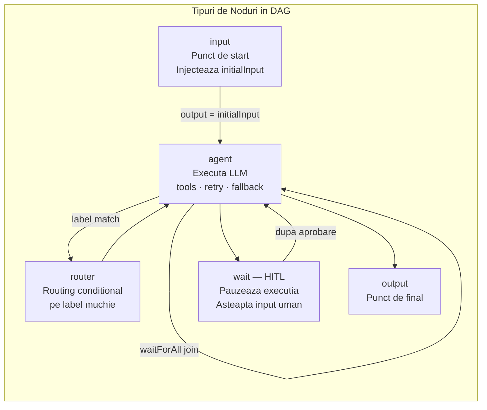

---

## 8. Use Case-uri

## 8. Cazuri de Utilizare (Use Cases)

### 8.1 Cercetare și Sinteză Automată
**Actor**: Cercetător sau analist  
**Scenariu**: Sistemul permite configurarea unui flux liniar compus din trei agenți specializați: (1) un agent cu rol de căutare, care primește un domeniu de studiu și interoghează surse externe, (2) un agent de sinteză, care agregă și rezumă datele extrase, și (3) un agent redactor, responsabil cu formatarea rezultatului într-un raport standardizat. Execuția este strict secvențială, rezultatul fiecărui pas devenind implicit parametrul de intrare pentru etapa subsecventă.

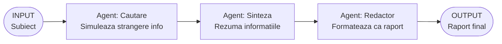

### 8.2 Proces de Revizuire a Codului Sursă (Code Review)
**Actor**: Inginer software  
**Scenariu**: Arhitectura susține instanțierea unui graf în care doi agenți operează concomitent asupra aceluiași segment de cod sursă: un specialist în securitate cibernetică și un evaluator de performanță. Prin aplicarea unui punct de sincronizare (*join node*), un al treilea agent (cu rol de *Tech Lead*) intră în așteptare până când ambele analize sunt finalizate, integrându-le ulterior într-un verdict decizional unificat.

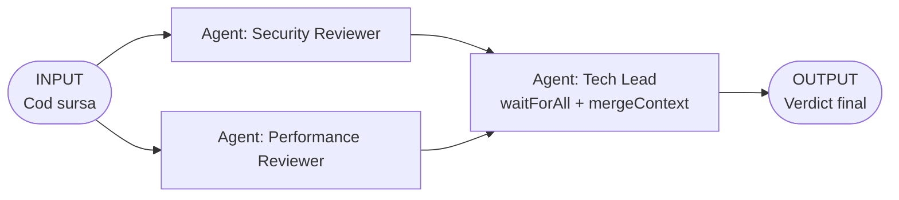

### 8.3 Execuție cu Supervizare Umană (Human-in-the-Loop)
**Actor**: Manager de conținut  
**Scenariu**: Un agent generează varianta preliminară a unui document. Sistemul interceptează un nod de tip `wait`, suspendând algoritmul și delegând controlul unui supervizor uman. Acesta analizează conținutul generat, introduce revizuiri calitative, după care declanșează reluarea asincronă a execuției. Nivelul următor al grafului asimilează atât documentul original cât și adnotările introduse manual pentru generarea livrabilului final.

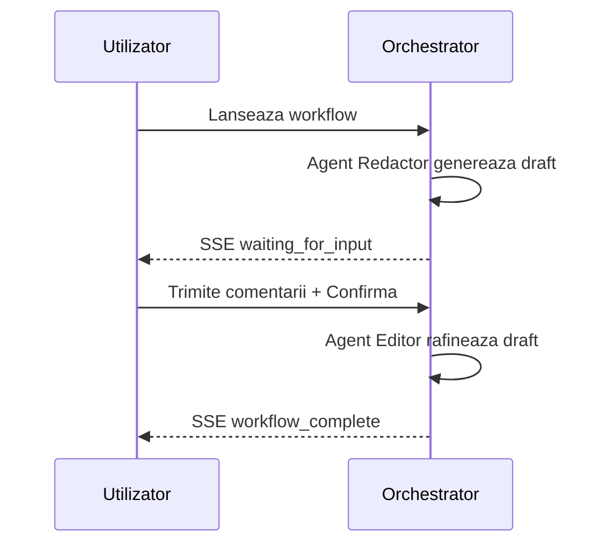

### 8.4 Sistem Agentic cu Memorie Persistentă
**Actor**: Analist de date  
**Scenariu**: Un agent analitic utilizează instrumentul de evaluare matematică pentru extragerea de metrici cantitative, apelând ulterior comanda `store_memory` pentru conservarea rezultatelor intermediare. Un agent separat de raportare, activat într-un stadiu ulterior al execuției, invocă metoda `retrieve_memory` pentru a accesa valorile structurate anterior, integrand aceste date deterministe într-o structură discursivă complexă.

### 8.5 Toleranță la Defectare prin Comutare Automată
**Actor**: Sistem automat  
**Scenariu**: Sistemul configurează un agent utilizând GPT-4o ca model primar și Claude Sonnet ca alternativă de rezervă. În eventualitatea eșuării serviciului primar (de exemplu, din cauza depășirii limitelor de rată ale API-ului), logica de orchestrare inițiază un număr definit de reîncercări cu spațiere exponențială (*exponential backoff*). La epuizarea acestora, se comută transparent execuția pe infrastructura Anthropic, asigurând continuitatea serviciului.

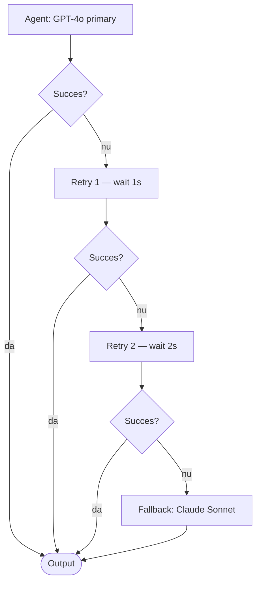

---

## 9. Arhitectura de Comunicație Frontend-Backend

### Operațiuni Tranzacționale (tRPC)
Transmisiunea datelor convenționale (CRUD) este gestionată printr-un canal tRPC. Această decizie arhitecturală garantează corectitudinea tipologică a mesajelor pe întregul flux (de la baza de date în browser), eliminând necesitățile de parsare manuală a datelor:
```
Frontend (React Query)  ←→  tRPC Client  ←→  tRPC Server  ←→  Mongoose  ←→  MongoDB
```

### Flux de Date Asincron (SSE)
Trimiterea răspunsurilor generate secvențial de LLM-uri presupune menținerea unui flux unidirecțional pe bază de evenimente. Aceasta se realizează prin protocolul Server-Sent Events, interfațat în browser prin API-ul nativ `fetch` cu consumul unui `ReadableStream`:
```
Frontend (fetch + ReadableStream)  →  POST /api/execute-stream  →  AsyncGenerator  →  SSE events
```
Setul de evenimente observabile cuprinde: `run_started`, `step_start`, `chunk`, `step_complete`, `state_updated`, `retry`, `fallback`, `waiting_for_input`, `workflow_complete` și `error`.

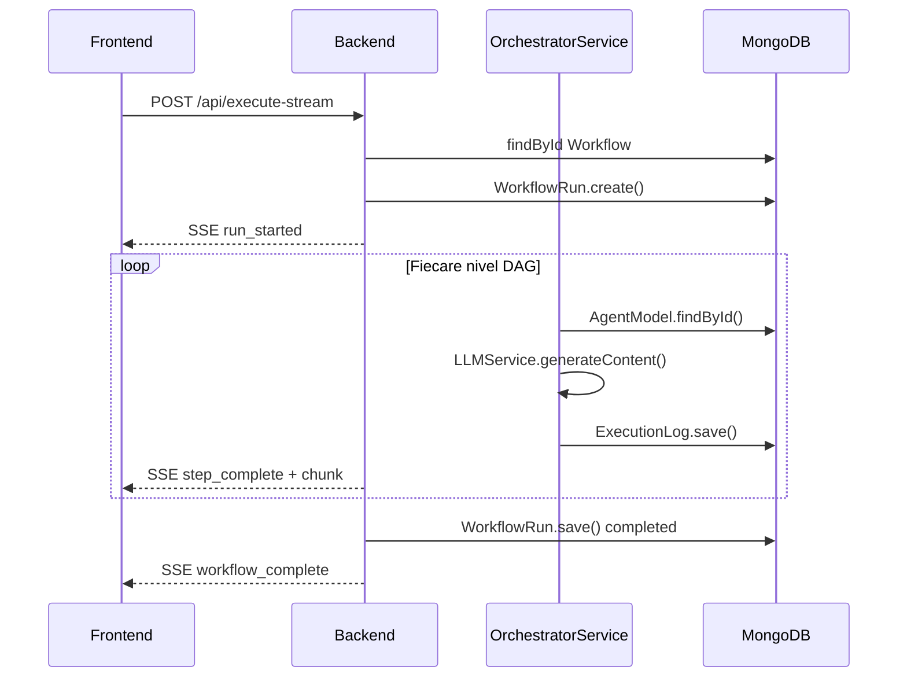

---

## 10. Considerente de Securitate

Pentru asigurarea integrității și confidențialității sistemului, au fost implementate următoarele politici de securitate:
- **Securitatea Datelor în Repaus**: Cheile de acces la API-urile furnizorilor de AI sunt criptate la nivel de bază de date utilizând algoritmul AES-256-CBC, vectorii de inițializare fiind generați aleator pentru fiecare instanță de stocare.
- **Controlul Fluxului de Cereri**: Serviciul aplică algoritmi de limitare a ratei de apel (*Rate Limiting*), fixând o constrângere superioară de 100 de cereri pe un interval de 15 minute, acționând ca un mecanism defensiv împotriva atacurilor de tip DoS.
- **Securitatea Variabilelor de Mediu**: Cheia master utilizată pentru criptarea simetrică este menținută exclusiv în spațiul de memorie volatila a containerului (via `.env`), nefiind expusă în surse persistente.
- **Validarea Intrărilor**: Întreg spectrul de interacțiuni prin tRPC traversează un strat de mediere ce garantează conformitatea datelor prin contractele definite în Zod.

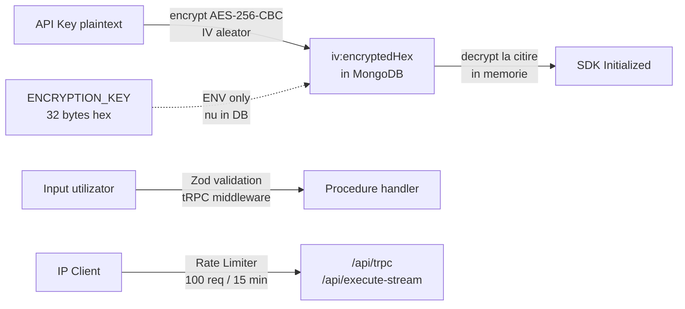

---

## 11. Arhitectura de Deployment

Aplicația este distribuită și orchestrată utilizând tehnologia de containerizare **Docker**. Fișierul de configurare asamblează trei servicii dependente temporal:

```yaml
services:
  mongodb:  # Gestiunea instanței de bază de date cu persistare pe volum separat
  backend:  # Server Node.js (tRPC/SSE)
  frontend: # Livrarea optimizată a artefactelor client-side
```

În regim de producție, arhitectura suportă agregarea stratului vizual direct de către instanța de Express (`express.static`), eliminând supraîncărcarea computațională generată de existența unui server web proxy adițional.

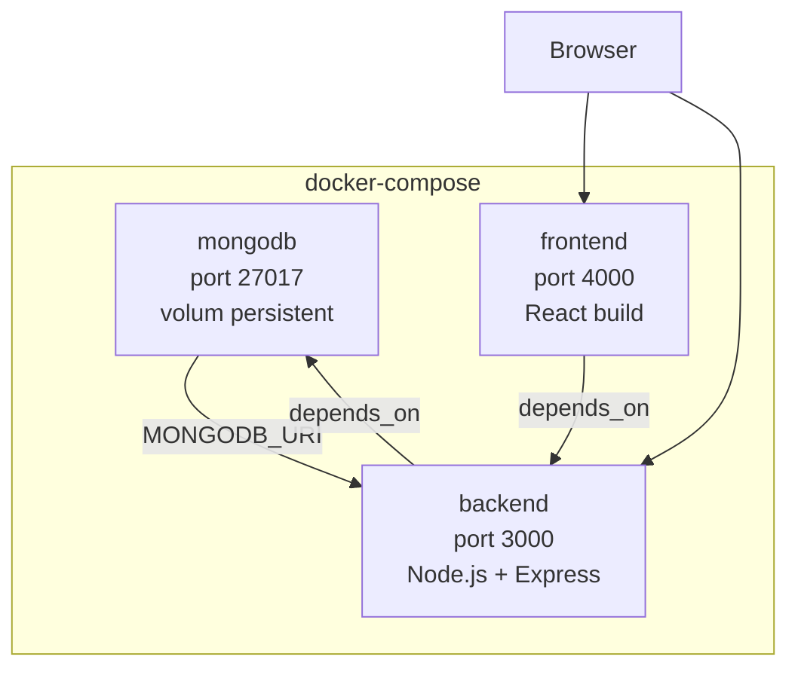

---

## 12. Metodologia de Testare

Fiabilitatea modulelor critice este verificată sistematic printr-o suită de teste unitare rulată de framework-ul **Vitest**, focusată pe următoarele componente majore:
- `LLMService.test.ts` — validarea logicilor de derivare a parametrilor și aplicarea polimorfică a clientilor API aferenți modelelor.
- `OrchestratorService.test.ts` — demonstrarea funcționării corecte a procedurii de sortare topologică a lui Kahn și tratarea erorilor de aciclicitate.
- `ToolService.test.ts` — testarea determinismului fiecărei sub-rutine asimilate de agent.
- `crypto.test.ts` — certificarea reversibilității și unicității produsului cifrat aferent cheilor de acces.

---

## 13. Concluzii

Platforma Orchestrator soluționează o vulnerabilitate operațională curentă a spațiului aplicațiilor bazate pe modele lingvistice: fragmentarea proceselor decizionale. Prin cuplarea unui mediu vizual de proiectare structurală cu un motor de execuție capabil de procesare paralelă, memorie globală și mecanisme autonome de revenire din stări de eroare, sistemul demonstrează maturitatea necesară scalării sarcinilor cognitive simulate.

Din perspectivă inginerească, contribuțiile definitorii ale implementării includ:
1. Construirea unui procesor de grafuri direcționate care paralelizează nativ execuția modelelor lingvistice și susține validări procedurale cu implicare umană.
2. Normalizarea interfețelor către o multitudine de furnizori comerciali AI fără pierderea capabilităților de toleranță la defectare.
3. Implementarea unui strat asincron de memorie persistenta ce interacționează fluent cu funcțiile native de uneltire (*tool-calling*) ale agenților moderni.
4. Proiectarea unei arhitecturi software în care corectitudinea datelor tranzitate între client și server este rezolvată la momentul compilării prin inferențe tipologice (tRPC și Zod).
5. Emiterea controlată a unor fluxuri de date complexe (SSE), esențială pentru transparența decizională pe parcursul generării de răspunsuri.

---

## 14. Bibliografie

### Documentație Oficială

1. **tRPC Documentation** — *End-to-end typesafe APIs made easy*  
   https://trpc.io/docs

2. **Mongoose ODM Documentation** — *Elegant MongoDB object modeling for Node.js*  
   https://mongoosejs.com/docs/

3. **MongoDB Manual** — *Aggregation Pipeline, Schema Design*  
   https://www.mongodb.com/docs/manual/

4. **React Documentation** — *The library for web and native user interfaces (v19)*  
   https://react.dev

5. **ReactFlow Documentation** — *Highly customizable React component for building node-based editors*  
   https://reactflow.dev/docs

6. **Zod Documentation** — *TypeScript-first schema validation with static type inference*  
   https://zod.dev

7. **Vite Documentation** — *Next Generation Frontend Tooling*  
   https://vitejs.dev/guide/

8. **Material UI Documentation** — *React UI component library (v9)*  
   https://mui.com/material-ui/

9. **TanStack Query Documentation** — *Powerful asynchronous state management for React (v5)*  
   https://tanstack.com/query/latest

10. **Google Generative AI SDK** — *@google/genai JavaScript SDK*  
    https://ai.google.dev/gemini-api/docs

11. **OpenAI API Reference** — *Platform documentation*  
    https://platform.openai.com/docs/api-reference

12. **Anthropic API Documentation** — *Claude API Reference*  
    https://docs.anthropic.com/en/api

### Lucrări Științifice și Articole

13. **Wei, J. et al.** (2022). *Chain-of-Thought Prompting Elicits Reasoning in Large Language Models*. NeurIPS 2022.  
    https://arxiv.org/abs/2201.11903

14. **Yao, S. et al.** (2023). *ReAct: Synergizing Reasoning and Acting in Language Models*. ICLR 2023.  
    https://arxiv.org/abs/2210.03629

15. **Park, J. S. et al.** (2023). *Generative Agents: Interactive Simulacra of Human Behavior*. UIST 2023.  
    https://arxiv.org/abs/2304.03442

16. **Shen, Y. et al.** (2023). *HuggingGPT: Solving AI Tasks with ChatGPT and its Friends in Hugging Face*. NeurIPS 2023.  
    https://arxiv.org/abs/2303.17580

17. **Wang, L. et al.** (2023). *A Survey on Large Language Model based Autonomous Agents*. Frontiers of Computer Science.  
    https://arxiv.org/abs/2308.11432

18. **Wu, Q. et al.** (2023). *AutoGen: Enabling Next-Gen LLM Applications via Multi-Agent Conversation*. Microsoft Research.  
    https://arxiv.org/abs/2308.08155

### Resurse Tehnice Complementare

19. **OWASP Cryptographic Storage Cheat Sheet** — *AES-256 best practices*  
    https://cheatsheetseries.owasp.org/cheatsheets/Cryptographic_Storage_Cheat_Sheet.html

20. **MDN Web Docs** — *Server-Sent Events (SSE) — Using server-sent events*  
    https://developer.mozilla.org/en-US/docs/Web/API/Server-sent_events

21. **Kahn, A. B.** (1962). *Topological sorting of large networks*. Communications of the ACM, 5(11), 558–562.  
    *(Algoritmul de sortare topologică implementat în OrchestratorService)*

22. **Docker Documentation** — *Compose file reference*  
    https://docs.docker.com/compose/compose-file/

23. **TypeScript Handbook** — *Type Inference, Generics, Utility Types*  
    https://www.typescriptlang.org/docs/handbook/

---

*Proiect realizat cu Node.js, React 19, tRPC, MongoDB, Mongoose, Zod, ReactFlow, Material UI, @google/genai, OpenAI SDK, Anthropic SDK.*
